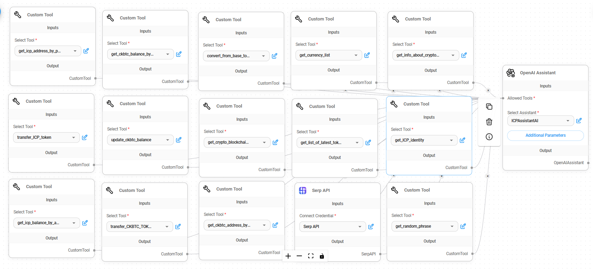

# ICP DEFI AI Assistant
### NB: This project is for demonstration purposes ONLY (not vetted or audited) and should not be used in production.
ICPAssistant is an AI assistant the provides general information about the blockchain, cryptocurrency, and helps you connect and interact with ledger canisters on the ICP including ICP token and ckbtc.

The aim of this project is to create a Defi Assistant, that helps you to interact with tokens and smart contracts on the Internet Computer. It can help you make transactions, provide you with information about tokens, and help you to interact with smart contracts or Bitcoin as contained in the [ICP Hackathon December 2023 Idea Doc](https://hackmd.io/rmKmStiVSZy54MCw8vrLJQ).

With this project we aim to make ICP easily accessible, and lower the adoption and learning curve to getting started with ICP. This means that, anyone that can chat can use the ICP and by extension decentralized techonology. We hope this drives adoption of blockchain technology globally.

# Tools and libraries
- Azle
- Typescript/Javascript
- Node JS
- Open AI
- Express
- Socket.io
- FlowiseAI
- WSL 2
- Rapid API
- Coin Market Cap API

# Resources
- Azle
- Open AI
- Flowise AI

# Pre-requsite
- Make sure you have all the necessary environment setup for working with [azle. check here](https://demergent-labs.github.io/azle/installation.html)
- For windows user work with [wsl](https://learn.microsoft.com/en-us/windows/wsl/install). Move folder to /home rather than working via mounting /mnt

# Setup
Some commands requires permission for the execution of certain scipts. In such case run `chmod u+x <path-to-script>` egs: 
- `chmod u+x ./scripts/deploy/all.sh`
- `chmod u+x ./scripts/deploy/ckbtc.sh` 
- `chmod u+x ./scripts/deploy/kyt.sh` 
- `chmod u+x ./scripts/deploy/minter.sh` 
- `chmod u+x ./scripts/install/all.sh` 
- `chmod u+x ./scripts/install/bitcoin.sh`

Install necessary dependencies
	
	npm install 

Make a copy of `.env.example` and rename to `.env` in `servers/ai` directory and provide the necessary keys
Deploy AI Assistant to your Open AI account directly

        

Run the following commands in different terminals

start bitcoinid:

    npm run bitcoin

Start dfx in the background

    npm run ic

install nns canisters

    dfx nns install

deploy local canisters

    npm run deploy

run ai server
        
    npm run deploy:ai

# Usage

#### Open ICP ledger UI at 
#### Open ICPAssistant UI at 

## 1. Interacting for blockchain information
* Get services or capability list: 

        What can you do?

1. Get list of top tokens: 

        What are the top 5 tokens

2. Get news: 

        get some cryptocurrency news

3. Get token price in any currency: 

        what is the price of btc in euro?

4. convert on token to another: 

        how much is btc in eth?

5. get info about a token: 

        where can i buy btc?
6. Get general info about the blockchain: 

        What is ICP?

## 1. Interacting with ICP ledger canister
1. instruct the ai bot to generate an ICP identity:      

        Generate a random ICP identity and tag as "account 1" 
        
    "account 1" can be any name you prefer. 
    
    You can also provide it a seed phrase to generate an identity: 
    
        generate identity from seed "<your-seed-mnemonic-phrase>"
    
2. Generate ICP token address: 

        generate icp token address for account 1

3. Mint some test ICP tokens on the UI at http://qsgjb-riaaa-aaaaa-aaaga-cai.localhost:8080/ and transfer some to the ICP address generated by the bot.
4. Check account balance via the bot: 

        what is the icp token balance of account 1?

5. transfer ICP token to another address: 

        transfer <X> icp tokens to <icp-token-address>
    Where `<X>` is the number of tokens to transfer. `<X>` must be less than the number of icp tokens in sender address.
6. Check account balance via the bot to see the effect of the transfer: 

        what is the icp token balance of account 1?

## 2. Interacting with CKBTC
1. instruct the ai bot to generate an ICP identity: 

        Generate a random ICP identity and tag as "<your-account-name>"` 
    You can also provide it a seed phrase to generate an identity 
    
        generate identity from seed "<your-seed-mnemonic-phrase>"

2. Generate ckbtc token address: 

        generate ckbtc token address for <your-account-name>

3. **In your terminal**, mint some test BTC to your wallet by running the following command, replacing <your-canister-btc-address> with the address from the chat bot: 

        npm run mint --address=<your-canister-btc-address>` 
    This will mint `49` ckbtc to you.
4. Now instruct the bot to retrieve the updated balance: 

        update ckbtc balance

5. instruct the bot to get the ckbtc balance: 

        what is the ckbtc balance of this account?

6. transfer ckbtc token to another address: 

        transfer <X> ckbtc to <another-ckbtc-address>

    Where <X> is the number of tokens to transfer. <X> must be less than the number of ckbtc tokens in sender address.
7. Check account balance via the bot to see the effect of the transfer: 

        what is the ckbtc balance of <your-account-name>?

# Acknowledgement and Contributions
